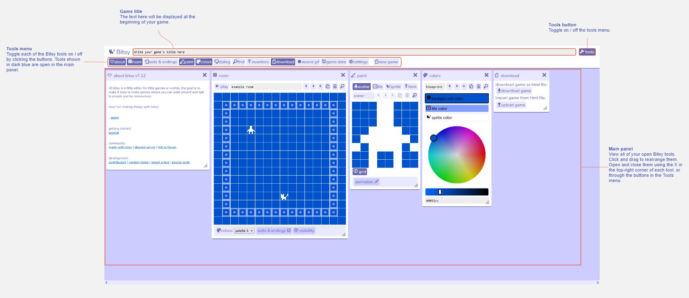

# Main Screen

When you first open Bitsy, you will see a selection of ‘tools’ open in the main panel. Above this is the tools menu which allows you to open and close these Bitsy tools. At the top of the main screen you can edit the title of your game, which will display when the game first begins.  
Bitsy games are composed of several rooms that your avatar can walk between. As your avatar walks around your Bitsy world they may interact with sprites (people, objects etc. that you can talk to) and items. Anything non-interactive in a room is called a tile, which is used for decoration.In Bitsy you create your sprites, items, tiles, and behaviour such as dialog and transitions between rooms in different tools from the tools menu, and then put them all together inside the room tool. The room tool is also where you can play the game you are creating, making it easy to switch back and forth between editing and testing.  
At any point you can download your game to play it outside of the Bitsy editor.  

