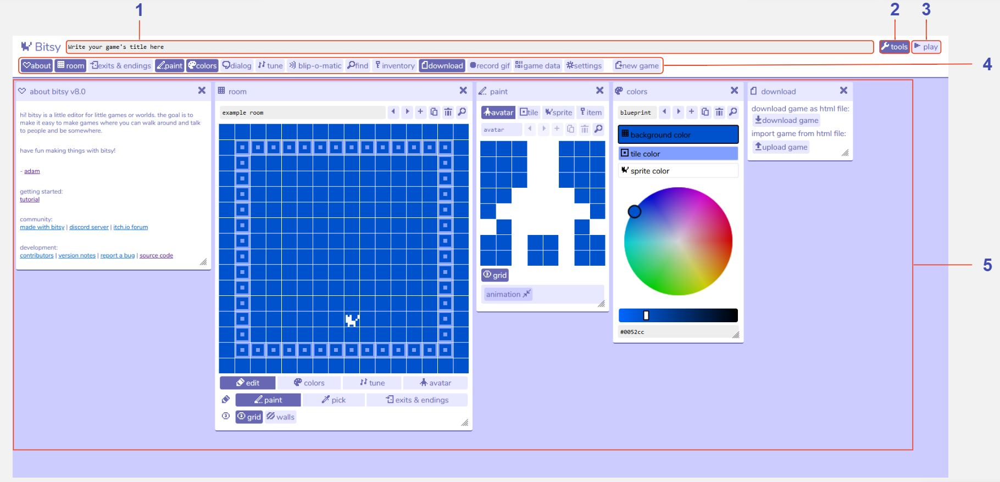

# Overview

## Description

When you first open Bitsy, you will see a selection of ‘tools’ open in the workspace. Above this is the toolbar which allows you to open and close these Bitsy tools. If you can't see the toolbar, click on the 'tools' button in the top-right of the screen. At the top of the workspace you can edit the title of your game, which will display when the game first begins.  

Bitsy games are composed of several [rooms](../tools/room) that your [avatar](../tools/paint/#avatar) can walk between. As your avatar walks around your Bitsy world they may interact with [sprites](../tools/paint/#sprite) (people, objects etc. that you can talk to) and [items](../tools/paint/#item). Anything non-interactive in a room is called a [tile](../tools/paint/#tile), which is used for decoration. In Bitsy you create your sprites, items, tiles, and behaviour such as [dialog](../tools/dialog) and [transitions between rooms](../tools/exitsandendings) in different tools from the toolbar, and then put them all together inside the room tool. The room tool is also where you can play the game you are creating, making it easy to switch back and forth between editing and testing.  

At any point you can download your game to play it outside of the Bitsy editor.

## Features

1. **Game title**. The text that you write here will be displayed at the beginning of your game.

2. **Tools button**. Toggle the toolbar on / off.

3. **Play button**. Press play to play and test your game. Then press stop to continue editing it.

4. **Toolbar**. Toggle each of the [Bitsy tools](../category/tools) on / off by clicking the buttons. Tools shown in dark blue are open in the workspace.

5. **Workspace**. View all of your active Bitsy tools. Click and drag to rearrange them. Open and close them using the X in the top-right corner of each tool, or through the buttons in the toolbar.