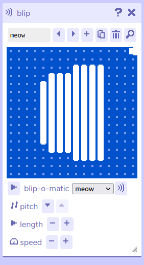

# Blip

## Description

The Blip tool lets you generate sound effects using several built-in generators and then tweak the results. These sound effects can be played when walking into [sprites](../paint/spritePaint), picking up [items](../paint/itemPaint), from [dialog](../dialog/soundActions), or as part of a [tune](../tune).

## Features

- **Navigation controls.** The top row of controls are the standard navigation and editing controls.
	- **Blip name.** Name your blip to easily refer to it in other tools.
	- **Previous / next blip.** Navigate sequentially through all the blips in the game.
	- **Add new blip.** Add a new blip. This blip will be generated using the currently selected [blip-o-matic](#blip-o-matic) generator.
	- **Duplicate blip.** Make a copy of the currently selected blip.
	- **Delete blip.** Delete the currently selected blip. (Cannot be undone!)
	- **Open blip in find tool.** Show blips in the find tool.
- **Blip visualiser.** Under the navigation controls is a visual representation of the blip based on how its frequency and volume changes over time. Click anywhere on the visualizer to play the blip with its current settings.
- **Playback and generator controls.**
	- **Play blip.** Click the play button to replay the blip with its current settings.
	- **Blip-o-matic.** Use the blip-o-matic dropdown to select the type of sound generator to use (see [blip-o-matic](#blip-o-matic) for a list).
	- **Regenerate blip.** Click the button next to the blip-o-matic dropdown to re-generate the current blip using the selected generator.
- **Adjust blip pitch.** Increase or decrease the frequency of the notes used in the blip.
- **Adjust blip duration.** Increase or decrease the total length of the blip.
- **Adjust blip speed.** Increase or decrease how quickly the blip cycles through notes.

## Blip-o-matic

Use the blip-o-matic dropdown to select different sound generators. The generators have names to indicate the types of things the sounds *could* be used for, but they can be used in many other ways as well. If the generators aren't quite making what you want, try using the pitch, duration, and speed controls to tweak the results. Experiment and have fun!

Here are the generators and their descriptions:
- **Pick up.** Sounds an item might make when you pick it up.
- **Greeting.** Sounds a sprite could say hello with.
- **Bloop.** Lower pitched, rounder sounds.
- **Bleep.** Higher pitched, tinnier sounds.
- **Magic.** Weird sounds.
- **Meow.** "I'm a cat."
- **Random.** Who knows???
- **Mutate.** Make a new blip from the selected one, with random tweaks.