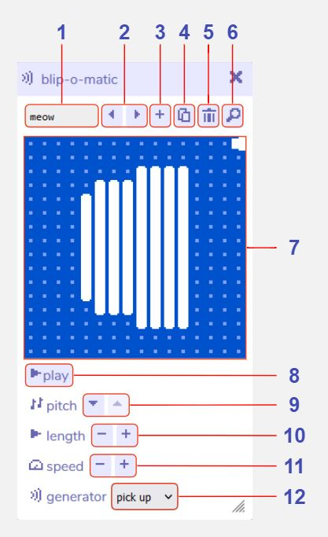

# Blip-o-matic

:::info This page is a stub
You can improve the docs by [expanding it](../../contributing).
:::

## Description

## Features

1. **Blip name.** 

2. **Previous / next blip.** 

3. **Add new blip.** 

4. **Duplicate blip.** 

5. **Delete blip.** 

6. **Open blip in find tool.** 

7. **Blip visualiser.** 

8. **Play blip.** 

9. **Adjust blip pitch.** 

10. **Adjust blip duration.** 

11. **Adjust blip speed.** 

12. **Type of sound to generate.** 