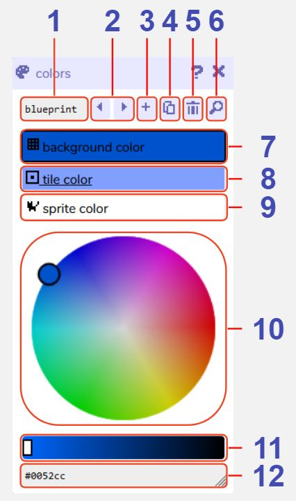

# Colors

## Description

Every room in Bitsy has a color palette containing three colours, which all the artwork in the room will use. You may have as many palettes as you like, and can assign any one of these to each [room](../room) in the [room settings](../room/roomSettings). 

The three colors in the palette are:

- background color (anything that is not interactive, the background color of all [tiles](../paint#tile) and [sprites](../paint#sprite))
- tile color (the foreground color of all your [tiles](../paint#tile))
- sprite color (the foreground color of your [avatar](../paint#avatar), [sprites](../paint#sprite), and [items](../paint#item))

Click on the background / tile / sprite color buttons to switch which one you are adjusting. Then, using the color picker wheel, you may select the hue and saturation of your color, and then adjust its darkness / lightness using the slider below.

Alternatively, if you know the exact hex code you want to use you can enter this in the text box at the bottom of the tool. 

## Features

1. **Color palette name**. The name of this current palette within the Bitsy editor. Used e.g. in the [find tool](../find) and [room settings](../room/roomSettings).

2. **Previous / next color palette buttons**. Navigate between all the palettes you have created.

3. **Add color palette button**. Creates a new palette. The colors tool will automatically switch view to that palette.

4. **Duplicate color palette button**. Creates a copy of the current palette. The colors tool will automatically switch view to that palette.

5. **Delete color palette button**. Deletes the current palette. A warning message will display before permanent deletion.

6. **Find color palette button**. Opens the find tool on the colors tab to display all the palettes you have created.

7. **Pick background color button**. Enables color picker wheel selection for the background color of this palette.

8. **Pick tile color button**. Enables color picker wheel selection for the tile color of this palette.

9. **Pick sprite color button**. Enables color picker wheel selection for the sprite color of this palette.

10. **Color picker wheel**. Drag the picker to adjust the color hue / saturation.

11. **Color picker darkness / lightness slider**. Drag the slider to adjust the color darkness / lightness.

12. **Color picker hex code**. Displays the hex code of the current color. You can also type the hex code in manually to set the color.
