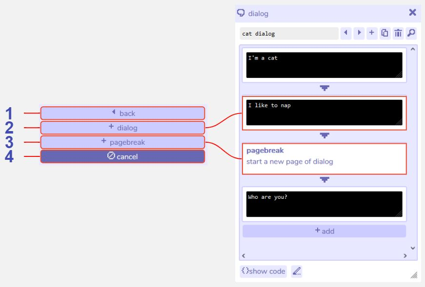

# Basic Dialog

## Description
Within the 'dialog' menu are the options to add a new basic dialog section, or a pagebreak to create spacing between sections. 

Please refer to the main [dialog tool](../dialog) page for general descriptions of the dialog tool and additional text effects.

## Features



1 **Back**. Returns to the main dialog section menu.

2 **Add dialog**. Any adjacent dialogs will play directly after each other with no spaces between, so in the example above the game would display `I'm a catI like to nap`. This layout is identical to combining the two pieces of text into one dialog box and in fact you may find that the Bitsy editor automatically combines them for you. Additional text effects can be added by clicking into the dialog box.

3 **Add pagebreak**. A pagebreak will create a new line in the text before displaying anything below it. It will also force the Bitsy engine to wait until the player has pressed an input before executing any further actions in the dialog, such as an exit or ending action. In the example above the whole text would display:

```
I'm a catI like to nap
Who are you?
```

4 **Cancel**. Closes the basic dialog options menu.