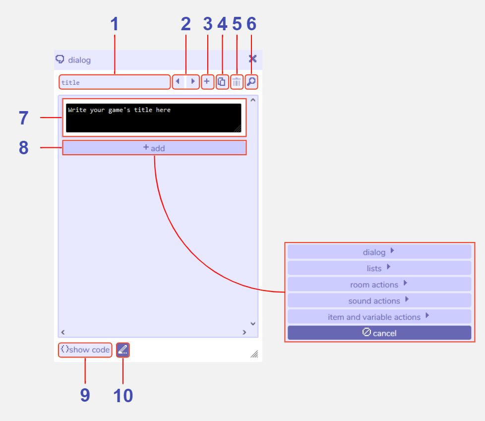
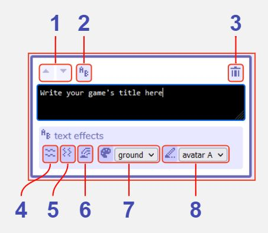

# Dialog

## Description

The dialog tool is one of Bitsy's most powerful tools. It is used to create all the interactions the player has within the game. 
For example, the most basic use of the dialog tool is to create text that will be displayed when the player walks into a [sprite](/tools/paint/#sprite), e.g. the cat saying "I'm a cat". 
At a more complex level it can be used for things like branching dialog with choices based on the number of [items](/tools/paint/#item) the player has picked up, or, unlocking a door if the player has spoken to a specific sprite. 
Dialog can be assigned to sprites, items, [exits and endings](/tools/exitsandendings). There is also a default 'title' dialog that can be edited. This will be displayed in the centre of the screen when the player first begins the game. 

Below is a list of the basic features of the dialog tool, along with the text effect options that are available any time you see an editable text window. 

For details of the more advanced dialog features, please refer to the following pages:

- [basic dialog](../dialog/basicDialog)  
- [lists](../dialog/lists)  
- [room actions](../dialog/roomActions)  
- [sound actions](../dialog/soundActions)  
- [item and variable actions](../dialog/itemVariableActions)

The dialog tool also allows you to view and edit the code for individual dialogs directly. Please see the page on [scripting](/advancedTopics/scripting) for more details. 

## Features

### Main dialog window

1 **Dialog name**. The name of this dialog within the Bitsy editor. Used e.g. in the [find tool](../find). The title name cannot be changed.

2 **Previous / next dialog buttons**. Navigate between all the dialogs you have created.

3 **Add new dialog button**. Creates a new empty dialog. The dialog tool will automatically switch view to this new dialog.

4 **Duplicate dialog button**. Creates a copy of the current dialog with a default name of 'dialog (x)'. The dialog tool will automatically switch view to this new dialog.

5 **Delete dialog button**. Deletes the current dialog. A warning message will display before permanent deletion.

6 **Open find tool: dialog**. Clicking this opens the [find tool](../find) and focuses it on the current dialog.

7 **Dialog editing window**. Clicking into this window allows you to edit the text that will display for this dialog. See [dialog editing tools](/tools/dialog#dialog-editing-tools) below for details of the additional editing options that appear.

8 **Add section**. Multiple sections of text and actions can be added to each dialog, which will be carried out from top to bottom during the game. Please refer to the specific pages for more details for: [basic dialog](../dialog/basicDialog), [lists](../dialog/lists), [room actions](../dialog/roomActions), [sound actions](../dialog/soundActions), [item and variable actions](../dialog/itemVariableActions). Press cancel to exit out of this options menu.

9 **Show code**. Toggles between the regular Bitsy interface and an editable window for code.

10 **Always show dialog of selected drawing**. When this is toggled on the dialog window will update as you switch between drawings in the [paint tool](../paint), displaying whichever dialog is assigned to that drawing.

### Dialog editing tools

These tools are visible by clicking inside the black dialog box. Click anywhere outside the window to minimise these additional options.

1 **Move dialog section up / down**. Click to change the execution order of  the sections of dialog / actions. All sections will be carried out one by one from top to bottom. If you only have one dialog section these buttons will be disabled.

2 **Show / hide text effects controls**. Toggles the visibility of the text effect options (features 14-18).

3 **Delete dialog section**. Deletes the current section from this dialog. Be careful as this will take effect immediately.

4 **Wavy text effect**. Clicking this inserts `{wvy}{/wvy}` within your text. Any text inside these tags will display with a wavy animation during the game, e.g. `{wvy}hello{/wvy}` would display the word 'hello' with a wavy animation. You can either click this button then type your text inside the tags, or select the text first then click this button to insert the tags around it.

5 **Shaky text effect**. Clicking this inserts `{shk}{/shk}` within your text. Any text inside these tags will display with a shaky animation during the game, e.g. `{shk}hello{/shk}` would display the word 'hello' with a shaky animation. You can either click this button then type your text inside the tags, or select the text first then click this button to insert the tags around it.

6 **Rainbow text effect**. Clicking this inserts `{rbw}{/rbw}` within your text. Any text inside these tags will display with a rainbow animation during the game, e.g. `{rbw}hello{/rbw}` would display the word 'hello' with a rainbow animation. You can either click this button then type your text inside the tags, or select the text first then click this button to insert the tags around it.

7 **Palette color text effect**. Clicking this inserts e.g. `{clr 0}{/clr}` within your text. Any text inside these tags will display in the color selected from the dropdown, e.g. `{clr 0}hello{/clr}` would display the word 'hello' in the background color of the [colors tool](../color) assigned to the room the player is currently in. 'tile' uses the tile color of the palette and shows as `{clr 1}`. 'sprite' uses the sprite color of the palette and shows as `{clr 2}`. You can either click this button then type your text inside the tags, or select the text first then click this button to insert the tags around it.

8 **Drawing text effect**. Clicking this inserts a tiny image of one of your drawings in the text, which you can select from the dropdown menu. This is displayed in the dialog window as e.g. `{drws "A"}` or `{drwi "tea"}`. You can either click this button then type your text inside the tags, or select the text first then click this button to insert the tags around it. If you are writing this code manually take note that the syntax is a little different between sprites and avatars (`{drws ""}`), tiles (`{drwt ""}`) and items (`{drwi ""}`). The string input inside the speechmarks can either be an id (like “A”) or a name (like “tea”).
