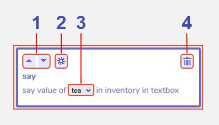

# Item and Variable Actions

:::info This page is a stub
You can improve the docs by [expanding it](../../contributing).
:::

## Description

## Features

### Main Item and Variable Actions window

1 **Back**. 

2 **Set item count**. [Click here for further details](/tools/dialog/itemVariableActions#set-item-count)

3 **Increase item count**. [Click here for further details](/tools/dialog/itemVariableActions#increase--decrease-item-count)

4 **Decrease item count**. [Click here for further details](/tools/dialog/itemVariableActions#increase--decrease-item-count)

5 **Say item count**. [Click here for further details](/tools/dialog/itemVariableActions#say-item-count)

6 **Set variable value**. [Click here for further details](/tools/dialog/itemVariableActions#set-variable-value)

7 **Change variable value**. [Click here for further details](/tools/dialog/itemVariableActions#change-variable-value)

8 **Say variable value**. [Click here for further details](/tools/dialog/itemVariableActions#say-variable-value)

9 **Cancel**. 

### Set item count

1 **Move section up / down**. 

2 **Additional settings**. 

3 **Delete action**. 

4 **Change expression item**. 

5 **Change expression value**. 

### Increase / decrease item count

1 **Move section up / down**. 

2 **Additional settings**. 

3 **Delete action**. 

4 **Change expression item**. 

5 **Change expression item**.

6 **Change expression operator**. 

7 **Change expression value**. 

8 **Open expression editor**. 

### Say item count

1 **Move section up / down**. 

2 **Additional settings**. 

3 **Change expression item**. 

4 **Delete action**. 

### Set variable value

1 **Move section up / down**. 

2 **Open expression editor**. 

3 **Additional settings**. 

4 **Delete action**. 

5 **Change expression variable**. 

6 **Change expression value**. 

### Change variable value

1 **Move section up / down**. 

2 **Open expression editor**. 

3 **Additional settings**. 

4 **Delete action**. 

5 **Change expression variable**. 

6 **Change expression variable**. 

7 **Change expression operator**. 

8 **Change expression value**. 

### Say variable value

1 **Move section up / down**. 

2 **Additional settings**. 

3 **Change expression variable**. 

4 **Delete action**. 
