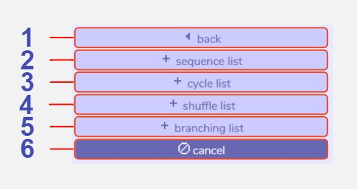
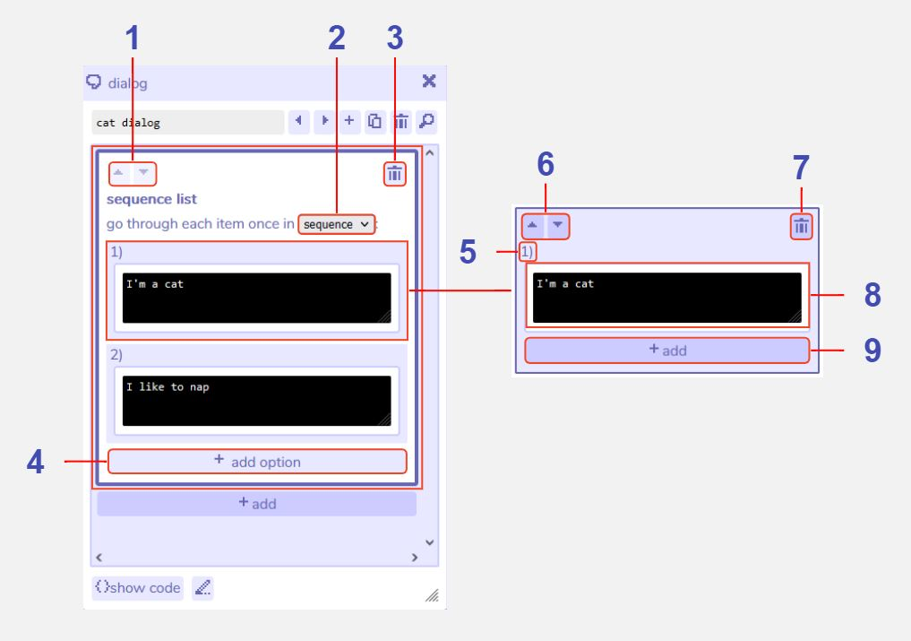
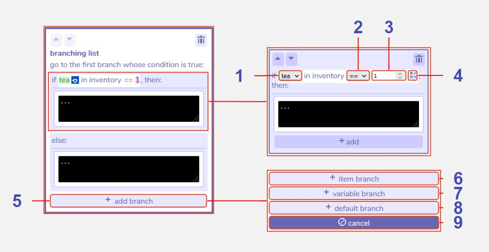

# Lists

## Description
Lists in Bitsy allow you to add more complexity to characters' dialog. Broadly there are two categories of list. The first includes 'sequence lists', 'cycle lists' and 'shuffle lists', which enable you to write several options for the text that will be displayed when interacting with that dialog. Each time you speak to that character the dialog will choose a different option, depending on the exact type of list it is. The other category is a 'branching list', which allows you to set up conditions to check against in order to choose which text to display. For example, you could set up a piece of text that would only display if the player has picked up three cups of tea. 

Branching lists can check against items or variables in their conditions and can be edited further using the [expression editor](../dialog/expressionEditor). 

## Features

### Main Lists window

1 **Back**. Returns to the main dialog section menu.

2 **Add sequence list**. Adds a sequence list section to the dialog sequence. [Click here for further details](/tools/dialog/lists#sequence-cycle-and-shuffle-lists)

3 **Add cycle list**. Adds a cycle list section to the dialog sequence. [Click here for further details](/tools/dialog/lists#sequence-cycle-and-shuffle-lists)

4 **Add shuffle list**. Adds a shuffle list section to the dialog sequence. [Click here for further details](/tools/dialog/lists#sequence-cycle-and-shuffle-lists)

5 **Add branching list**. Adds a branching list section to the dialog sequence. [Click here for further details](/tools/dialog/lists#branching-lists)

6 **Cancel**. Closes the list menu.

### Sequence, cycle, and shuffle lists

#### Sequence lists

In a sequence list, the first time you interact with this dialog in the game, only the top item will be displayed (e.g. in this example "I'm a cat"). The next time you talk to them, the second item will be displayed ("I like to nap"), and so on until the last item is reached. After that it will always display the last item.

#### Cycle lists

In a cycle list, the first time you interact with this dialog in the game, only the top item will be displayed (e.g. in this example "I'm a cat"). The next time you talk to them, the second item will be displayed ("I like to nap"), and so on until the last item is reached. After that it will begin from the first item again and repeat. 

#### Shuffle lists

In a shuffle list, each time you interact with this dialog in the game, a random item from the list will be chosen to display. The random behaviour is set up so that every item will display once before any are repeated. 

1 **Move section up or down**. All sections in each dialog will execute in the order they are shown in the dialog tool - from top to bottom. Use these buttons to move sections up and down to change the execution order.

2 **Change list type**. Swap between sequence, cycle, and shuffle list behaviour. Since a branching list behaves differently it is not included in this list and must be added separately.

3 **Delete section**. Clicking this button removes the entire list from the dialog.

4 **Add option**. This button is visible by clicking into the white space at the top of the list section. Clicking 'add option' adds another list item to the bottom of the list. You may have as many list items as you like. If the tool becomes tricky to navigate due to a large number of list items, an alternative way to edit them is by clicking 'show code', where the list items will be displayed as e.g. " - I'm a cat". If you use this method, keep in mind that all list items must be on a new line with a hyphen (-) at the start of the line.

5 **Sequence order number**. This number indicates the appearance order of the list item in a sequence or cycle list. E.g. item 1 will appear first. In a shuffle list the order is randomised.

6 **Move list item up or down**. In a sequence or cycle list, the list items will appear in the order indicated by their sequence number (see above). Use these buttons to change that order.

7 **Delete list item**. Clicking this button removes the individual list item from the list.

8 **Dialog editing window**. Allows editing of the text that will display for that list item.

9 **Add additional behaviour to list item**. This 'add' option allows you to add further dialog or action options to the list item. For example a list item may include a piece of dialog and also a room action to change the color palette of the room. This option is only visible by clicking into the pale blue space surrounding the list item.

### Branching lists

In a branching list a condition is specified (such as "if tea in inventory == 1, which means the player must have picked up one tea). If the condition is true, the top branch will display. If the condition is false the bottom ("else") branch will display. You can also add more branches that check for other conditions, such as another [item](../paint/#item) or [variable](../inventory/#variables). These will show up in the tool as "else if" branches and will be checked only if the first "if" condition is false.  

Generally you should follow this pattern:

if ....

else if ....

else ...

You must have one 'if' section, you can optionally have one 'else' section, and you can optionally have as many 'else if' sections as you like (the interface does allow other combinations, but may not behave as you want it to).

1 **Change expression item**. Select an item that you have created from the dropdown list to use in the conditional expression (see feature 5).

2 **Change expression operator **. Select an operator for the conditional expression. '==' means the number of the item in the inventory must be exactly the same as the value to the right of the expression. '>=' means the item number must be either the same as or more than the value. '<=' means the item number must be either the same as or less than the value.  '>' means the item number must be more than, but not the same as the value. '<' means the item number must be less than, but not the same as the value.

3 **Change expression value**. Enter a value for the conditional expression. This is the number that is checked against, e.g. in the example shown above the number of 'tea' the player has must be 1 for the condition to be true.

4 **Edit expression**. Opens an expression editor tool with more advanced options for conditional expressions.

5 **Add branch**. Allows you to add another branch to the list with its own conditional expression. This branch will then be carries out if that expression is true.

6 **Add item branch**. Adds an 'else if' branch to the list with a condition that allows you to check the value of an inventory item.

7 **Add variable branch**. Adds an 'else if' branch to the list with a condition that allows you to check the value of a variable.

8 **Add default branch**. Adds an 'else' branch with no condition and a dialog window to edit text. An 'else' branch will only execute if all the other branches conditions are false.

9 **Cancel adding branch**. Closes the add branch menu.