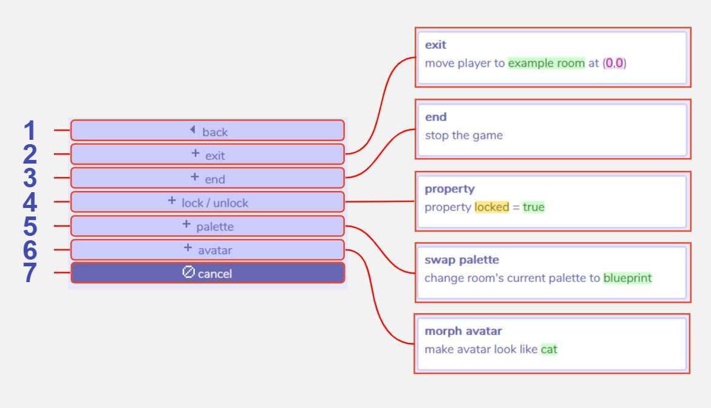
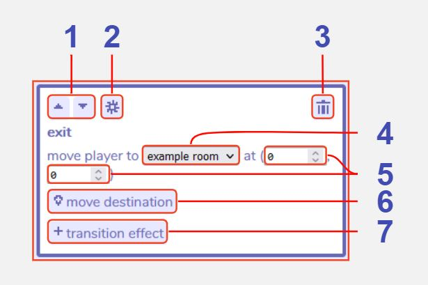
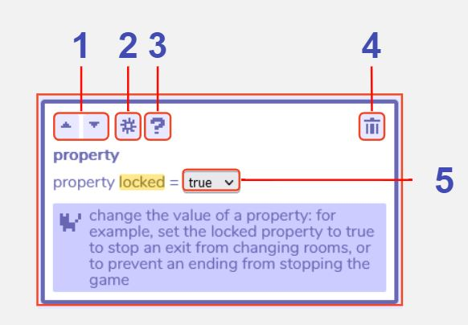
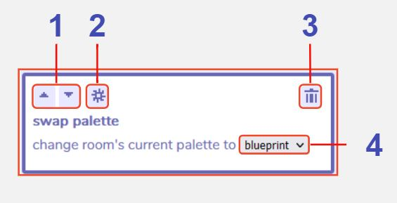
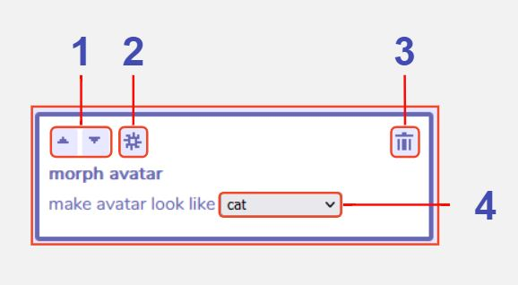

# Room Actions

:::info This page is a stub
You can improve the docs by [expanding it](../../contributing).
:::

## Description

## Features

### Main Room Actions window

1 **Back**. Returns to the main dialog section menu.

2 **Add exit action**. [Click here for further details](/tools/dialog/roomActions#exit-action)

3 **Add end action**. When executed this action triggers the end of the game. The game stops immediately, but if there is dialog after this action, it will still play. There are no additional features to this action. 

4 **Add lock / unlock action**. [Click here for further details](/tools/dialog/roomActions#lock--unlock-action)

5 **Add palette action**. [Click here for further details](/tools/dialog/roomActions#palette-action)

6 **Add avatar action**. [Click here for further details](/tools/dialog/roomActions#avatar-action)

7 **Cancel**. Closes the room actions menu.

### Exit Action

1 **Move section up or down**. All sections in each dialog will execute in the order they are shown in the dialog tool - from top to bottom. Use these buttons to move sections up and down to change the execution order.

2 **Additional settings**.

3 **Delete action**. Clicking this button removes the action from the dialog.

4 **Destination room**.

5 **Destination room coordinates**.

6 **Move destination**.

7 **Add transition effect**.

### Lock / Unlock Action

1 **Move section up or down**. All sections in each dialog will execute in the order they are shown in the dialog tool - from top to bottom. Use these buttons to move sections up and down to change the execution order.

2 **Additional settings**.

3 **Turn help text on / off**.

4 **Delete action**. Clicking this button removes the action from the dialog.

5 **Property value**.

### Palette Action

1 **Move section up or down**. All sections in each dialog will execute in the order they are shown in the dialog tool - from top to bottom. Use these buttons to move sections up and down to change the execution order.

2 **Additional settings**.

3 **Delete action**. Clicking this button removes the action from the dialog.

4 **Palette to swap to**.

### Avatar Action

1 **Move section up or down**. All sections in each dialog will execute in the order they are shown in the dialog tool - from top to bottom. Use these buttons to move sections up and down to change the execution order.

2 **Additional settings**.

3 **Delete action**. Clicking this button removes the action from the dialog.

4 **Image to morph avatar to**.