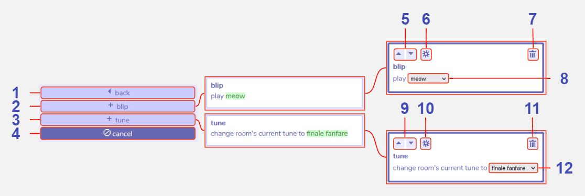

# Sound Actions

:::info This page is a stub
You can improve the docs by [expanding it](../../contributing).
:::

## Description

## Features

1 **Back**. Returns to the main dialog section menu.

2 **Add blip action**.

3 **Add tune action**.

4 **Cancel**. Closes the room actions menu.

5 **Move section up or down**. All sections in each dialog will execute in the order they are shown in the dialog tool - from top to bottom. Use these buttons to move sections up and down to change the execution order.

6 **Additional settings**.

7 **Delete action**. Clicking this button removes the action from the dialog.

8 **Blip to play**. 

9 **Move section up or down**. All sections in each dialog will execute in the order they are shown in the dialog tool - from top to bottom. Use these buttons to move sections up and down to change the execution order.

10 **Additional settings**.

11 **Delete action**. Clicking this button removes the action from the dialog.

12 **Tune to change to**. 