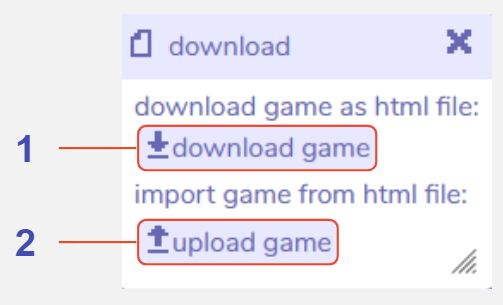

# Download

## Description

The download tool can be used to export your Bitsy game as an .html file. While your internet browser should remember the settings in your current game (unless you delete your internet cache), this can be useful for backing up your work.

An .html file can be opened in any internet browser to play the game. You could also send the .html to other people for them to play your game.

Websites such as [itch.io](https://itch.io) also allow you to create an account and upload your game for free if you want a permanent place to host your game. [Click here](/faq/uploadToItch) for a tutorial on uploading games to Itch.io. 

This tool also allows you to import an existing .html format Bitsy game so that you can edit it. You could import a game of your own that you have previously exported, or you can import anyone else's game that you have the .html format of. If you do want to re-use someone else's game or the assets they have created you should always seek their permission first. 

An alternative way to import and export Bitsy games is through the [game data tool](../gamedata).

## Features

1. **Download game.** Downloads your Bitsy game as an .html file, which can be opened in any internet browser to play, or uploaded to a game hosting platform such as itch.io to share with other people.

2. **Upload game.** Upload a Bitsy game from .html format into the Bitsy editor to edit it.
