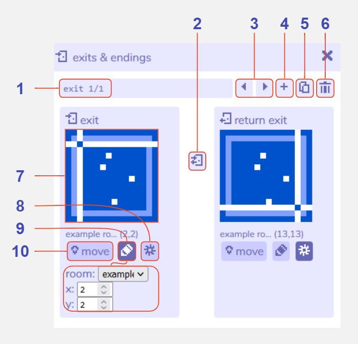
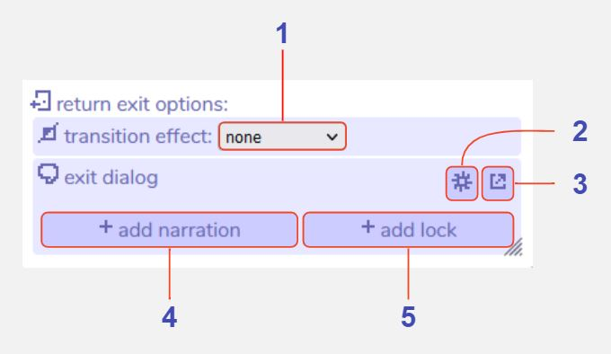

# Exits & Endings

## Description

The exits & endings tool enables you to create transitions between or within rooms. When the player walks into an exit during the game they will be teleported to a location that you specify in the editor.

There are a number of visual effects you can apply, such as screen-wipes or fades, as well as dialog that triggers on an exit, or a condition such as a locked door.

Exits & endings are created in this tool, and are visualised in the [room tool](../room) if the exits & endings visibility is enabled in [room settings](../room/roomSettings).

Exits & endings are separated into three types:

### Exit

A connection between two locations that can be accessed from either direction. For example, this may link together two separate rooms, or teleport the player to another location within the same room. 

### One-way exit

A connection between two locations that can only be accessed from the starting location.

### Ending

A location that triggers the end of the Bitsy game. Transition effects cannot be added, but a lock may still be added by using the [dialog tool](../dialog). In a locked ending the game will return the player to the room they were previously in if the lock condition is false. 

## Features

### Main exits & endings window

1 **Exit or Ending identifier**. This indicates which exit or ending you are viewing, out of the total in the current room.

2 **Change exit direction**. Click to toggle between three options: a one-way exit leading from the left location to the right location, a one-way exit leading from the right location to the left location, or a two-way exit.

3 **Previous / next exit buttons**. Navigate between all the exits and endings you have created for the current room open in the room tool.

4 **Add exit or ending button**. Opens a menu with options for '[exit](#exit)', '[one-way exit](#one-way-exit)', or '[ending](#ending)'. Please see above for descriptions of each. Clicking any of these creates a new exit of that type and brings it into focus within the tool, or 'cancel' will return to the main exits & endings view.

5 **Duplicate exit or ending**. Creates a copy of the current exit or ending. The starting location will automatically shift one grid cell over to avoid a conflict. The exits & endings tool will automatically switch view to that exit or ending.

6 **Delete exit or ending button**. Deletes the current exit or ending. A warning message will display before permanent deletion.

7 **Location of marker**. These thumbnails display the location of the start or end point of the exit or ending. The text above describes the type of exit: exit (start location for a one- or two-way exit), destination (end location for a one-way exit), return exit (end location for a two-way exit, which can also be returned through), ending (location of an ending).

8 **Show / hide exit options**. Opens the text, lock, and transition effect options for the exit location. For two-way exits you can open the exit options for both locations by clicking this button under each thumbnail. [Click here for further details](#exit-options)

9 **Edit coordinates**. Toggles a small options menu that allows you to change the location of the exit by entering room coordinates. The 'room' dropdown allows you to select which room the exit should be in, and 'x' and 'y' refer to the grid cell coordinate, where 0,0 is the top-left of the room and 15,15 is the lower-right.

10 **Move exit location**. Click to place the location marker in the current room. This allows you to change the location of the exit more visually. Navigate to the desired room first in the room tool, then click this button, then click the location for the exit in the room tool view.

### Exit options

1 **Select transition effect**. Choose from several options that add a visual animation to the player's movement between rooms. You can add one effect to each side of an exit. Effects include fade (a black or white screen fades, then fades out to reveal the player at the new location), slide (the whole room view moves across the screen) etc. Bear in mind that any background music will pause during these animations.

2 **Add narration**. Clicking this changes the exit dialog menu to an editable dialog window. Anything you write here will display when the player walks through that exit or ending.

3 **Add lock**. Clicking this creates a new dialog with a 'lock' condition, and opens the dialog tool with it in focus. A locked exit requires you to meet a certain condition before you can use the exit (by default, this is the player having picked up a 'key' item) and is a type of [room action](../dialog/roomActions) dialog.

4 **Exit dialog editor**. Toggle between a dropdown list of all your dialogs, and a small dialog-editor window that allows you to edit the current exit dialog. If you have already clicked 'add narration' or 'add lock' you will find that these buttons do not reappear, but you can always add a lock or extra dialog through the dialog tool. If you have chosen to add a lock you may also see special characters such as curly brackets, which are used to code in extra features. If you are not comfortable with this, you can open the dialog in the dialog tool instead.

5 **Open dialog tool**. Clicking this will open the current exit dialog in the dialog tool. This can be useful if you have a complex dialog that includes locks or other conditions.
