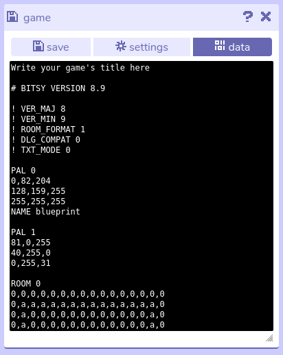

# Data

:::caution 
Editing your game data directly may result in the game becoming unplayable or having unwanted effects. 
:::

## Description

The data menu allows you to view your Bitsy game's raw data in text format. All images, dialogs, rooms etc. that you have created are represented here and can be edited.

However, it is a good idea to create a backup of your game before doing this in case any changes you make have unwanted effects, such as the game becoming unplayable. 

Create a backup using the [save menu](save).

## Features

- **Raw text of the Bitsy game data file.** This text box displays all the data in the Bitsy game in text format. Be cautious if you edit this, as changing this data can potentially make your game unplayable.
	- **Note:** By default, font data is hidden due to its large size. If you need to view this data, you can make it visible in the [settings menu](settings).