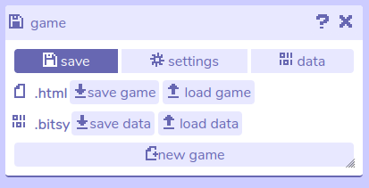

# Game

## Description

The game tool is where you manage your current project file, settings, and game data.

## Features

The game tool has three sub-menus:

- **Save.** The [save menu](save) is where you export and import your game, or start a new project.
- **Settings.** The [settings menu](settings) contain configuration options for the editor tools, the game engine, and exported .html files. Language and font settings are located here.
- **Data.** The [data menu](data) lets you view or edit the raw data for your game in a plaintext format.