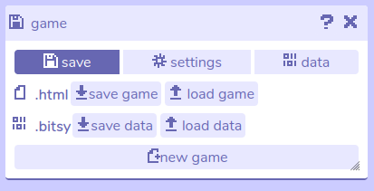

# Save

## Description

The save menu can be used to export your Bitsy game as an .html file. While your internet browser should remember the settings in your current game (unless you delete your internet cache), this can be useful for backing up your work.

An .html file can be opened in any internet browser to play the game. You could also send the .html to other people for them to play your game.

Websites such as [itch.io](https://itch.io) also allow you to create an account and upload your game for free if you want a permanent place to host your game. [Click here](/faq/uploadToItch) for a tutorial on uploading games to Itch.io. 

This menu also allows you to import an existing .html format Bitsy game so that you can edit it. You could import a game of your own that you have previously exported, or you can import anyone else's game that you have the .html format of. If you do want to re-use someone else's game or the assets they have created you should always seek their permission first.

In this menu you can also import and export Bitsy games as a .bitsy file, or start a new project.

## Features

- **Game file tools.** Save / load .html game files.
	- **Save game.** Save your Bitsy game as an .html file, which can be opened in any internet browser to play, or uploaded to a game hosting platform such as itch.io to share with other people.
	- **Load game.** Import a Bitsy game from an .html file into the Bitsy editor to edit it.
- **Data file tools.** Save / load .bitsy data files.
	- **Save data.** This button will save the game data for your current Bitsy game in a .bitsy format. This is a text-based data format that can be opened in a program such as Notepad.
	- **Load data.** Opens a file browser window to allow you to import pre-existing game data in .bitsy format. Be aware that this will override the current game data in your game, so you may want to create a backup of your work before you do this using 'save data' or 'save game'.
- **New game.** Start a new project containing only the default Bitsy room. (*This will delete your current game!* Save a backup if you wish to keep a copy of your work.)