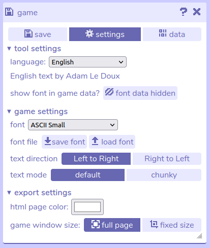

# Settings

## Description

The settings tool contains several useful customisations to do with font, language, and export settings. 

## Features

- **Tool settings.** Options for configuring the Bitsy editor tools.

	- **Language.** Choose from the dropdown menu to set the editor default language. Translations are created manually by the community. If you notice something that is missing in your language please feel free to [contribute](/contributing#translating-editor-text).

	- **Font data.** In the [data menu](data) the font used for your text in Bitsy is hidden by default due to its large size (especially for languages with many characters). Leave this as hidden unless you need to view the font data specifically.

- **Game settings.** Options for configuring the Bitsy game engine.

	- **Game font.** Choose a font from the dropdown menu that your in-game dialog will be displayed in. Generally this choice will depend on the language you are writing in.

		- ASCII is a set of 128 characters from the English language, but does not include characters from European languages, such as é, á etc.

		- Unicode includes several thousand more characters than ASCII, and is recommended if you are writing in a European language. (There are small and large versions of this font.)

		- Unicode Asian includes additional characters for Asian languages such as Chinese, Japanese, and Korean.

		- Arabic is a pixel font with Arabic characters.

		- Custom Font allows you to use your own custom font. This must be a file in the .bitsyfont format, which can be imported with the 'load font' button.

	- **Font file tools.** Save / load .bitsyfont files.

		- **Save font.** Clicking this saves a .bitsyfont file of the font selected in the dropdown menu above. This plaintext file can be edited in external tools.

		- **Load font.** Import a .bitsyfont file you've made or found on the web to use via the 'Custom Font' option in the font dropdown (see above).

	- **Text direction.** This changes whether text appears on screen from left to right, or from right to left in the game.

	- **Text mode.** Choose from 'default' or 'chunky' to set the scale of the text.

- **Export settings.** These settings are related to games exported as HTML files.

	- **HTML page color.** Opens a color picker that changes the background color outside of the game. This is visible when the game is downloaded and opened in an internet browser, or as the background color if you [upload your game to Itch.io](/faq/uploadToItch).

	- **Game window size.** When set to 'full page', a bitsy game that is downloaded and opened in an internet browser will be scaled at full-screen. 'Fixed size' allows you to set a custom size in pixels that the game will display at. Since Bitsy games have a square aspect ratio, the width and height will always be equal.