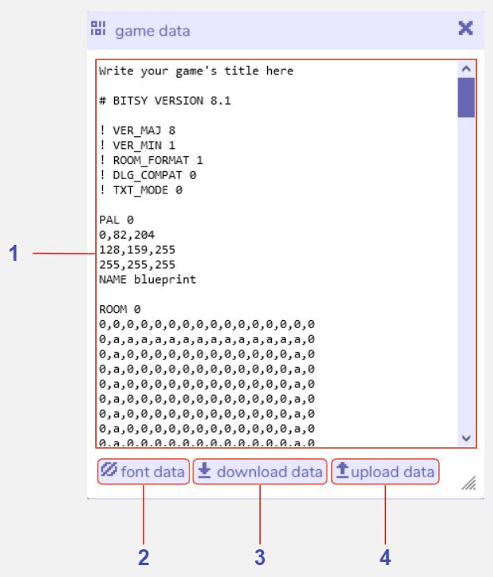

# Game Data

:::caution 
Editing your game data directly may result in the game becoming unplayable or having unwanted effects. 
:::

## Description

The Game Data tool allows you to view your Bitsy game's raw data in text format. All images, dialogs, rooms etc. that you have created are represented here and can be edited. 
However, it is a good idea to create a backup of your game before doing this in case any changes you make have unwanted effects, such as the game becoming unplayable. 
Create a backup by downloading the game data in this tool or by using the [download tool](../download). 

## Features

1. **Raw text of the Bitsy game data file.** This text box displays all the data in the Bitsy game in text format. Be cautious if you edit this, as changing this data can potentially make your game unplayable.

2. **Font data.** Data about the font used for your text in Bitsy is contained in the game data but is hidden by default due to its large size (especially for languages with many characters). Leave this as hidden unless you need to view the font data specifically.

3. **Download data.** This button will download the game data for your current Bitsy game in a .bitsy format. This is a text-based data format that can be opened in a program such as Notepad.

4. **Upload data.** Opens a file browser window to allow you to import pre-existing game data in .bitsy format. Be aware that this will override the current game data in your game, so you may want to create a backup of your work before you do this using 'download data' or the download tool.