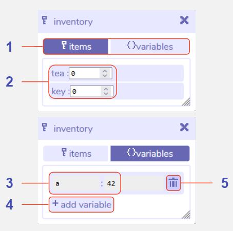

# Inventory

## Description

The inventory tool keeps track of all the items and variables that you create in the Bitsy editor and interact with while playing the game.

### Items

Items are created through the paint tool (see [items](../paint#item)). An entry for each item will automatically be added to the item list in the inventory when you create an item.

While playing the game, every time the player interacts with an item, its number will increase by 1 in the inventory tool.

This information can then be used in tools such as [dialog](../dialog) or [exits & endings](../exitsandendings) to construct conditional behaviour (e.g. the player can only open a door if they have picked up a key, or, the cat will only tell you a secret if you have picked up a cup of tea).

The values of all items will reset once you stop playing the game. By default all items are set to 0, but you can edit this number if for example you want the player to begin the game with 1 key.  

### Variables

Variables are custom pieces of information that you can create to keep track of anything other than item counts in your game. You may add as many variables as you like, and name them in a way that makes sense to you, though it is advisable to avoid spaces in your names (e.g. use something like `var1` rather than `var 1`).

An example of a use of variables would be to track how many times you have talked to a sprite, then have a particular piece of dialog display once you have talked to them a certain number of times, but there are many uses for variables!

Variables can be changed or referenced within tools like [dialog](../dialog) using specific dialog options, or through editing the dialog's code. 

For a more detailed introduction to Bitsy variables and how to update them using Bitsy code, please see [this tutorial by ayolland](https://ayolland.itch.io/trevor/devlog/29520/bitsy-variables-a-tutorial).

## Features

1. **Items / Variables tabs.** Click to switch the tool view between editing items of variables.

2. **Item list and counts.** A list of all the items you have created in the paint tool, along with their default value that the game should begin at for each one.

3. **Variable name and value.** The default name and value for each variable you have created. It is best practice not to use spaces within the variable name. The value of the variable can be a number or text.

4. **Add new variable button.** Click to add a new variable to the variable list.

5. **Delete this variable button.** Click to delete the variable displayed to the left of the button.