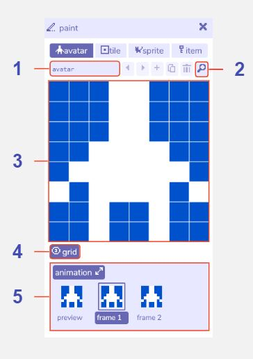

# Avatar Paint

## Features

### Avatar paint

1. **Avatar name**. The name of the [avatar](../paint/#avatar) within the Bitsy editor. Used e.g. in the [find tool](../find). The avatar name cannot be changed.

2. **Find drawing button**. Opens the find tool on the avatar tab.

3. **Paint canvas**. Edit the currently selected drawing by clicking the pixels to toggle them on / off. Any changes are also updated immediately in the [room tool](../room).

4. **Show / hide grid**. Toggle a pixel grid on / off in the paint canvas. The grid is not displayed when playing the game.

5. **Avatar animation**. Opens the animation panel where you can edit two animation frames. Select frame 1 or frame 2 to edit it in the paint window. The preview shows how the animation will look when playing the game.
