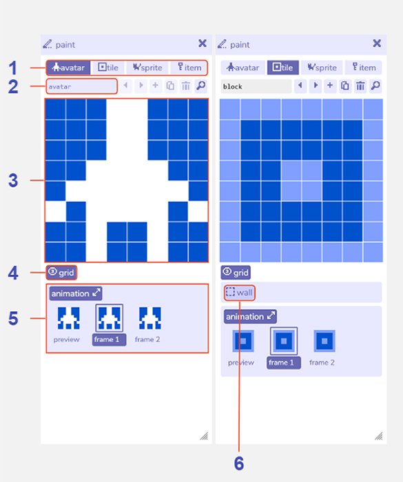

# Paint

## Description

The paint tool is where you can create and edit all the objects in your game, such as people to interact with, items to pick up, and background decorations. 
All drawings can be edited and animated, and each category of drawing has additional behaviour, described in the sections below. 

To edit any drawing, click the pixels in the main paint canvas to toggle them on or off. All drawings use the 'background color' set up in the [colors tool](../color) as the background color. 
Then, tiles use the 'tiles color', and avatars, sprites, and items use the 'sprite color' as the foreground. 
Since you can put any of your drawings in any room, the background and foreground colors will update automatically depending on which room you are currently in. 

All the drawings you create can be found here by navigating through the tabs and arrow buttons at the top of the tool, but you can also access them from the [find tool](../find).

If you have the [room tool](../room) open, you can also hold alt + click on a drawing in the room to open it in the paint tool. 

### Avatar

The avatar is who you control when playing the game. Because Bitsy games are single player there is only one avatar in the game. 
However, you can optionally choose to use one of your sprites in each room in place of your avatar in [room settings](../room/roomSettings). 

### Tile

Tiles are used to decorate your rooms. You can create as many tiles as you like, and for each one you can place as many as you like in your rooms. 
Tiles can be set as 'wall', which means that the avatar is unable to walk through them. 

### Sprite

Sprites are people or objects in your game that you can talk to. You can give them [dialog](../dialog) that plays out when the avatar walks up to them. You can also assign a sound effect that plays when the dialog begins. 
You can create as many sprites as you like, however you can only have one version of each sprite in the game. 
So if for example you want two cats with their own dialog, you would need to create two separate cat sprites. 

### Item

Items are things that you can pick up. An in-game inventory will count the number of each type of item the avatar has collected, which you can then use in some of the advanced dialog settings, or as a condition for an exit or ending. 

## Features

1. **Paint category**. Switch tab to edit your [avatar](../paint/#avatar), [tiles](../paint/#tile), [sprites](../paint/#sprite), or [items](../paint/#item). The four panels here show the options in each category.

2. **Drawing name**. The name of this current drawing within the Bitsy editor. Used e.g. in the [find tool](../find). The avatar name cannot be changed.

3. **Paint canvas**. Edit the currently selected drawing by clicking the pixels to toggle them on / off. Any changes are also updated immediately in the [room tool](../room).

4. **Show / hide grid**. Toggle a pixel grid on / off in the paint canvas. The grid is not displayed when playing the game.

5. **Drawing animation**. Opens the animation panel where you can edit two animation frames. Select frame 1 or frame 2 to edit it in the paint window. The preview shows how the animation will look when playing the game.

6. **Wall button**. Makes the tile act as an impassable wall when the player tries to walk into it. You can check which tiles in your room are walls with the wall visibility button in [room settings](../room/roomSettings).

7. **Sound effect button**. Choose a [blip sound effect](../blipomatic) that will play when the player walks into this sprite / item. Choose none if you do not want a sound effect.

8. **Sprite / item dialog**. The [dialog](../dialog) that is displayed when the player walks into this sprite  or item.

9. **Dialog selection toggle**. Click this button to show a dropdown menu of all the dialogs you have created. Clicking it again will allow you to edit the current dialog.

10. **Dialog editor button**. Opens the dialog tool for more advanced dialog options.

11. **Previous / next drawing buttons**. Navigate between all the tiles, sprites, or items you have created. As there is only one avatar these buttons are not available in the avatar tab.

12. **Add drawing button**. Creates a new tile, sprite, or item. The paint tool will automatically switch view to that drawing. New avatars cannot be added.

13. **Duplicate drawing button**. Creates a copy of the current tile, sprite, or item. The paint tool will automatically switch view to that drawing. The avatar cannot be duplicated.

14. **Delete drawing button**. Deletes the current tile, sprite, or item. A warning message will display before permanent deletion. The avatar cannot be deleted.

15. **Find drawing button**. Opens the find tool on the avatar, tile, sprite, or item tab to display all the drawings you have created in that category.
