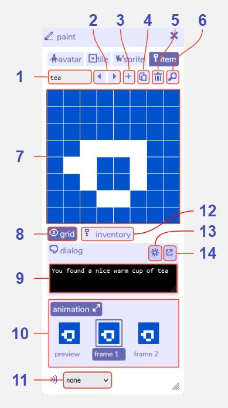

# Item Paint

## Features

### Item paint

1. **Item name**. The name of this current [item](../paint/#item) within the Bitsy editor. Used e.g. in the [find tool](../find).

2. **Previous / next item buttons**. Navigate between all the items you have created.

3. **Add item button**. Creates a new item. The paint tool will automatically switch view to that item.

4. **Duplicate item button**. Creates a copy of the current item. The paint tool will automatically switch view to that item.

5. **Delete item button**. Deletes the current item. A warning message will display before permanent deletion.

6. **Find item button**. Opens the find tool on the item tab to display all the items you have created.

7. **Paint canvas**. Edit the currently selected sprite by clicking the pixels to toggle them on / off. Any changes are also updated immediately in the [room tool](../room).

8. **Show / hide grid**. Toggle a pixel grid on / off in the paint canvas. The grid is not displayed when playing the game.

9. **Item dialog**. The [dialog](../dialog) that is displayed when the player walks into this item.

10. **Item animation**. Opens the animation panel where you can edit two animation frames. Select frame 1 or frame 2 to edit it in the paint window. The preview shows how the animation will look when playing the game.

11. **Sound effect button**. Choose a [blip sound effect](../blipomatic) that will play when the player walks into this item. Choose none if you do not want a sound effect.

12. **Open inventory**. Opens the [inventory tool](/tools/inventory/).

13. **Dialog selection toggle**. Click this button to show a dropdown menu of all the dialogs you have created. Clicking it again will allow you to edit the current dialog.

14. **Dialog editor button**. Opens the dialog tool for more advanced dialog options.