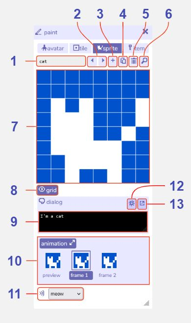

# Sprite Paint

## Features

### Sprite paint

1. **Sprite name**. The name of this current [sprite](../paint/#sprite) within the Bitsy editor. Used e.g. in the [find tool](../find).

2. **Previous / next sprite buttons**. Navigate between all the sprites you have created.

3. **Add sprite button**. Creates a new sprite. The paint tool will automatically switch view to that sprite.

4. **Duplicate sprite button**. Creates a copy of the current sprite. The paint tool will automatically switch view to that sprite.

5. **Delete sprite button**. Deletes the current sprite. A warning message will display before permanent deletion.

6. **Find sprite button**. Opens the find tool on the sprite tab to display all the sprites you have created.

7. **Paint canvas**. Edit the currently selected sprite by clicking the pixels to toggle them on / off. Any changes are also updated immediately in the [room tool](../room).

8. **Show / hide grid**. Toggle a pixel grid on / off in the paint canvas. The grid is not displayed when playing the game.

9. **Sprite dialog**. The [dialog](../dialog) that is displayed when the player walks into this sprite.

10. **Sprite animation**. Opens the animation panel where you can edit two animation frames. Select frame 1 or frame 2 to edit it in the paint window. The preview shows how the animation will look when playing the game.

11. **Sound effect button**. Choose a [blip sound effect](../blipomatic) that will play when the player walks into this sprite. Choose none if you do not want a sound effect.

12. **Dialog selection toggle**. Click this button to show a dropdown menu of all the dialogs you have created. Clicking it again will allow you to edit the current dialog.

13. **Dialog editor button**. Opens the dialog tool for more advanced dialog options.