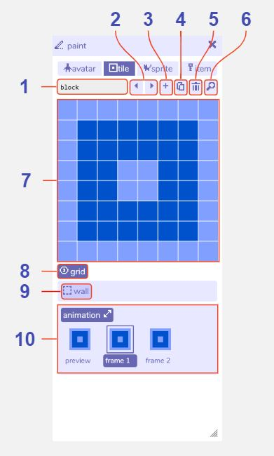

# Tile Paint

## Features

### Tile paint

1. **Tile name**. The name of this current [tile](../paint/#tile) within the Bitsy editor. Used e.g. in the [find tool](../find).

2. **Previous / next tile buttons**. Navigate between all the tiles you have created.

3. **Add tile button**. Creates a new tile. The paint tool will automatically switch view to that tile.

4. **Duplicate tile button**. Creates a copy of the current tile. The paint tool will automatically switch view to that tile.

5. **Delete tile button**. Deletes the current tile. A warning message will display before permanent deletion.

6. **Find tile button**. Opens the find tool on the tile tab to display all the tiles you have created.

7. **Paint canvas**. Edit the currently selected tile by clicking the pixels to toggle them on / off. Any changes are also updated immediately in the [room tool](../room).

8. **Show / hide grid**. Toggle a pixel grid on / off in the paint canvas. The grid is not displayed when playing the game.

9. **Tile animation**. Opens the animation panel where you can edit two animation frames. Select frame 1 or frame 2 to edit it in the paint window. The preview shows how the animation will look when playing the game.