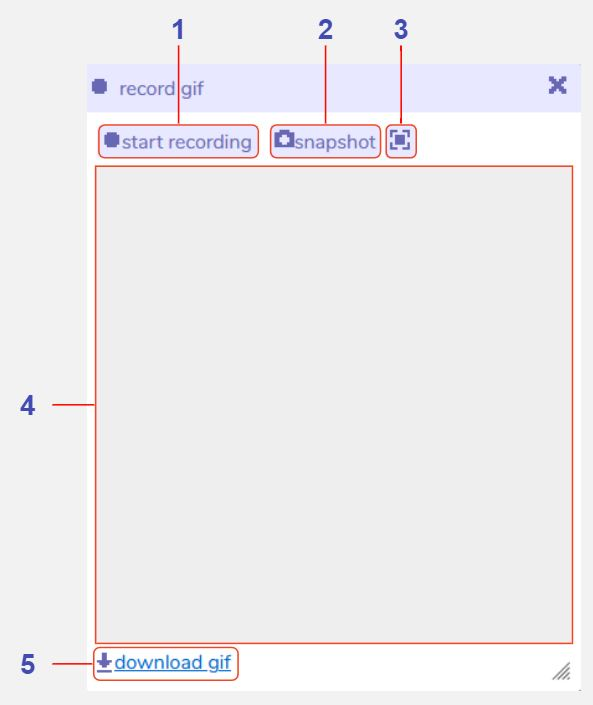

# Record GIF

## Description

The record gif tool can be used to save snapshots and animations of your Bitsy game, and can be used in both edit and play modes within the Bitsy editor. After you create a recording you can download it as a .gif file, but be aware that only your most recent capture is stored within the Bitsy editor, so make sure to download any recordings that you like before creating a new one. 

## Features

1 **Start recording**. Click to begin recording, then click again on 'stop recording' to stop. You can record either in edit or play mode, and any changes in the [room view](../room) will be captured. Once you click 'stop recording' the gif will encode (this may take some time, depending on the length of your recording). Once encoded, the gif will play on loop in the recording window. Pressing 'start recording' again will override the current gif.

2 **Snapshot**. Click to take a screenshot of the [room view](../room). You can take a snapshot in either edit or play mode. This will override any previous snapshot or gif that you have taken.

3 **Snapshot mode**. Toggle between square and landscape modes for the snapshot feature. Square mode creates a gif sized 512x512 pixels. Landscape mode creates a gif sized 726x576 pixels with padding around the edges in the same colour as the main background. This only applies to snapshots, and not animated gifs.

4 **Recording window**. Displays the current animated gif or snapshot that you have created. This will be overridden every time you press 'start recording' or 'snapshot' so consider downloading your gif before creating a new one.

5 **Download gif**. Click this to save a copy of the current gif to your computer. This will create a file called 'recording.gif' in your Downloads folder. All animated gifs are sized at 512x512 pixels, and snapshots will be 512x512 pixels or 726x576 pixels depending on which snapshot mode you have selected.
