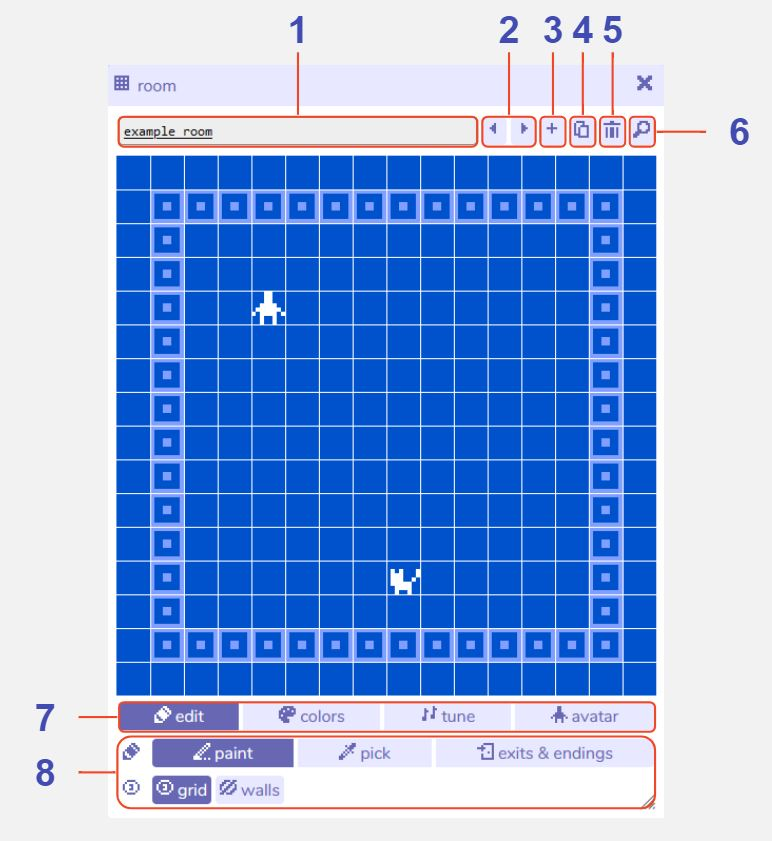

# Room

## Description

A 'room' in Bitsy is where the action takes place! Rooms are where your avatar walks around and talks to others.

You may have as many rooms as you would like and can connect them together using the [exits & endings tool](../exitsandendings), allowing your avatar to walk between them. 

Rooms are always composed of 16x16 tiles, but what is in each of those tiles is up to you. 

There are several [room editing rools](../room/roomEditingTools) and [room settings](../room/roomSettings) available at the bottom of the room tool that allow you to change the appearance, behaviour and audio of each room. 

## Features

1. **Room name**. The name of this current room within the Bitsy editor. Visible e.g. in the [find tool](../find), but not to the player.

2. **Previous / next room buttons**. Navigate between all the rooms you have created.

3. **Add room button**. Creates a new room. The room tool will automatically switch view to that room.

4. **Duplicate room button**. Creates a copy of the current room. Features such as tiles, color palette and exits & endings will be copied to the new room, but unique features such as the avatar and sprites will not be copied. The room tool will automatically switch view to the new duplicate room.

5. **Delete room button**. Deletes the current room. A warning message will display before permanent deletion.

6. **Find room button**. Opens the find tool on the room tab to display all the rooms you have created.

7. **Room Editing Tools and Room Settings menu**. Switches between different room editing options and settings. E.g. clicking 'edit' will display the room editing tools.

8. **Room Tool options**. Displays options for the currently selected room editing tool or setting.