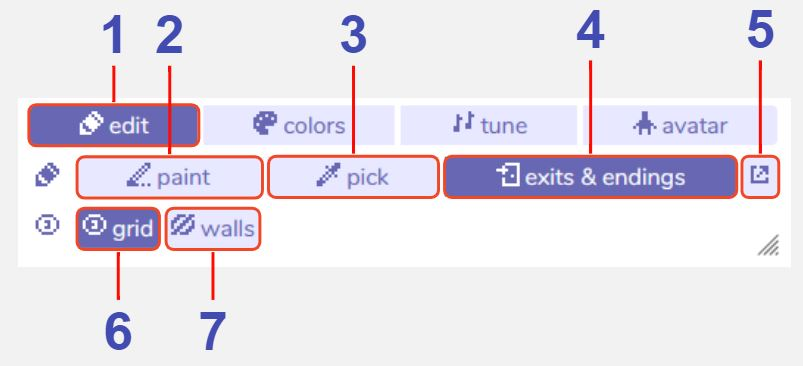

# Room Editing Tools

## Description

The Room Editing tools allow you to change the appearance of the room, set the locations of exits and endings, toggle visibility of a grid to assist you wihle editing, and display the location of any 'wall' tiles (see [tiles](../paint/#tile)).

## Features

1. **Room editing tools.** With this selected, the room editing tools are accessible. The other buttons in this row (colors, tune, avatar) will take you to the [room settings](roomSettings).

2. **Paint editing.** With this selected, the room's sprites, tiles, items and the avatar can be moved, added, or erased. Choose what you want to paint using the paint tool, then click a square in the room view to add or remove it.

3. **Eyedropper.**  With this selected, clicking on any sprite, tile, item or avatar in the room will open it in the paint tool. A shortcut for this feature is to hold *ALT + click* while in the paint editing.

4. **Exits & Endings editing.** With this selected, all exits and endings in the current room will become visible in the room view. The currently selected one shows in black and will flash (along with its paired exit if this is in the same room), and all others show up in white. Click and drag these to move them around in the room view.

5. **Open Exits & Endings tool.** This button is only visible while the Exits & Endings editing is enabled. Clicking this button is a shortcut to open the [exits & endings tool](../exitsandendings) focused on any currently selected exit/ending in the room view.

6. **Show / hide tile grid.** Toggles a grid on / off in the room tool. The grid is only visible while editing, not while playing the game. The visibility of the grid in the room tool will show up in any [recorded gifs](../recordGIF). 

7. **Show / hide wall tiles.** If you have set any tiles as 'wall' in the [paint tool](../paint), a white or black (depending on your color palette) overlay will show the location of these. This is only visible while editing, not while playing the game.
