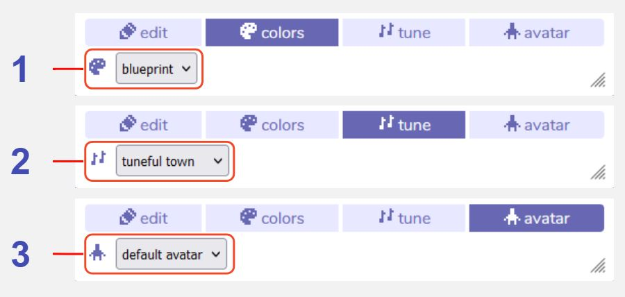

# Room Settings

## Description

The Room Settings tools allow you to change some aspects of the entire room. You can choose to apply any of the color palettes you have created, set a tune to play in the background of the room, or override the base appearance of the avatar. 

## Features

1. **Colors dropdown menu.** Choose one of the color palettes you created in the colors tool to apply to the current room.

2. **Tune dropdown menu.** Choose one of the tunes you created in the tune tool to apply to the current room.

3. **Avatar dropdown menu.** Choose one of the sprites you created in the paint tool to override the appearance of the avatar in the current room. This will only apply the look of the sprite to the avatar, not any of the other settings such as dialog.