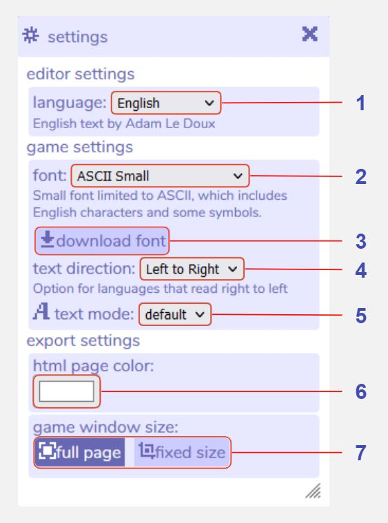

# Settings

## Description

The settings tool contains several useful customisations to do with font, language, and export settings. 

## Features

1. **Language.** Choose from the dropdown menu to set the editor default language. Translations are created manually by the community. If you notice something that is missing in your language please feel free to [contribute](/contributing#translating-editor-text).

2. **Game font.** Choose a font from the dropdown menu that your in-game dialog will be displayed in. Generally this choice will depend on the language you are writing in.

	ASCII is a set of 128 characters from the English language, but does not include characters from European languages, such as é, á etc.

	Unicode includes several thousand more characters than ASCII, and is recommended if you are writing in a European language.

	Unicode Asian includes additional characters for Asian languages such as Chinese, Japanese, and Korean.

	Arabic is a pixel font with Arabic characters.

	Custom Font allows you to upload your own custom font. This must be in the .bitsyfont format.

3. **Download font.** Clicking this downloads a .bitsyfont file of the font selected in the dropdown menu above.

4. **Text direction.** This changes whether text appears on screen from left to right, or from right to left in the game.

5. **Text mode.** Choose from 'default' or 'chunky' to set the scale of the text.

6. **HTML page color.** Opens a color picker that changes the background color outside of the game. This is visible when the game is downloaded and opened in an internet browser, or as the background color if you [upload your game to Itch.io](/faq/uploadToItch). A preview is also visible in the [room tool](../room).

7. **Game window size.** When set to 'full page', a bitsy game that is downloaded and opened in an internet browser will be scaled at full-screen. 'Fixed size' allows you to set a custom size in pixels that the game will display at. Since Bitsy games have a square aspect ratio, the width and height will always be equal.