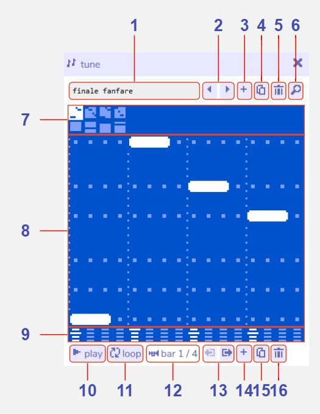
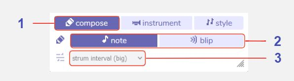
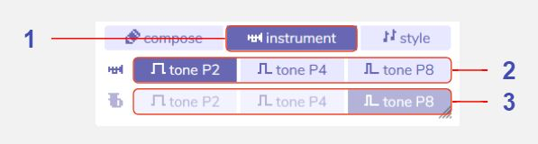
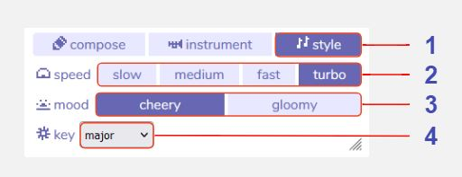

# Tune

:::info This page is a stub
You can improve the docs by [expanding it](../../contributing).
:::

## Description

## Features

### Main panel

1. **Tune name.** 

2. **Previous / next tune.** 

3. **Add new tune.** 

4. **Duplicate tune.** 

5. **Delete tune.** 

6. **Open tune in find tool.** 

7. **Bar selector (melody and harmony).** 

8. **Piano roll.** 

9. **Note octave.** 

10. **Play.** 

11. **Toggle loop on / off.** 

12. **Bar indicator.** 

13. **Move selected bar left / right.** 

14. **Add new bar.** 

15. **Duplicate selected bar.** 

16. **Delete selected bar.** 

### Compose settings

1. **Compose button.** 

2. **Note entry tool.** 

3. **Harmony strum pattern (arpreggios).** 

### Instrument settings

1. **Instrument button.** 

2. **Melody instrument tone.** 

3. **Harmony instrument tone.** 

### Style settings

1. **Style button.** 

2. **Tune speed (tempo).** 

3. **Tune mood.** 

4. **Key.** 