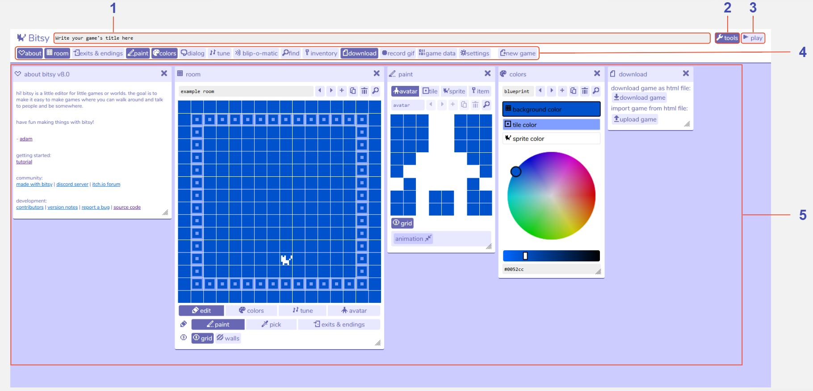

# 概览

## 描述

当你第一次打开Bitsy时，你会看到工作区中打开了一组“工具”。在这些工具的上方是工具栏，它允许你打开和关闭这些Bitsy工具。如果你看不到工具栏，请点击屏幕右上角的“工具”按钮。在工作区的顶部，你可以编辑游戏的标题，它。

Bitsy游戏由一些[房间](../tools/room)组成，你的[角色](../tools/paint/#avatar)可以在它们之间行走。当你的角色在Bitsy世界中行走时，他们可能会与[精灵(Sprite)](../tools/paint/#sprite)（一个术语，可以与之交谈的人物、物体等）和[物品(Item)](../tools/paint/#item)进行互动。房间中任何不可交互的元素都被称为[瓷砖(Tile)](../tools/paint/#tile)，它们被用于装饰。在Bitsy中，你可以使用工具栏中的不同工具创建你的精灵、物品、瓷砖，以及行为，比如[对话](../tools/dialog)和[房间间的转移](../tools/exitsandendings)等。然后将它们放置在房间工具中进行组合。房间工具还可以用来玩你正在制作的游戏，方便在编辑和测试之间切换。

你可以随时下载你的游戏，以在Bitsy编辑器之外游玩它们。

## 特性

1. **游戏标题。** 你写在这里的文本将在游戏开始时显示。
2. **工具(tools)按钮。** 显示/隐藏工具栏。
3. **播放(play)按钮。** 点击“播放(play)”按钮播放并且测试你的游戏。然后“停止(stop)”点击按钮继续编辑它。
4. **工具栏。** 通过点击这些按钮来开/关每一个[Bitsy工具](../category/tools)。显示为深蓝色的工具是已经在工作区中被打开的。
5. **工作区。** 查看你启用的所有Bitsy工具。点击并拖拽来重新排列它们。通过点击每个工具窗口右上角的“X”来关闭它们，或者通过工具栏里的按钮来开/关它们。
